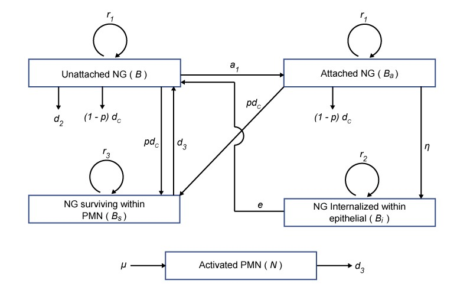
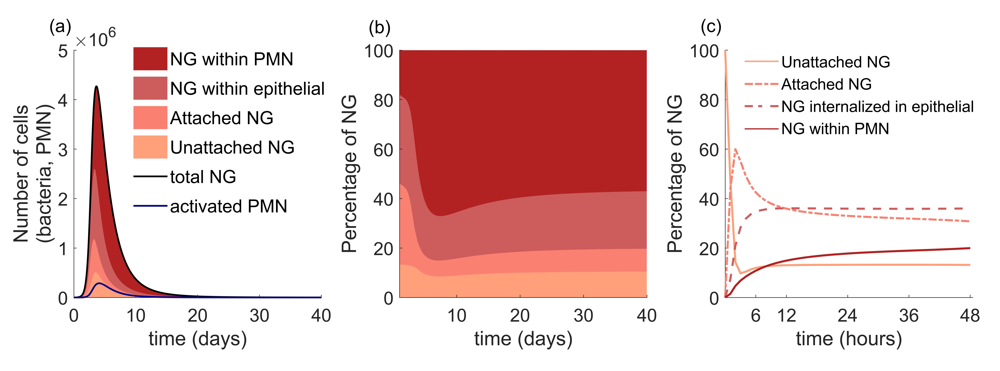
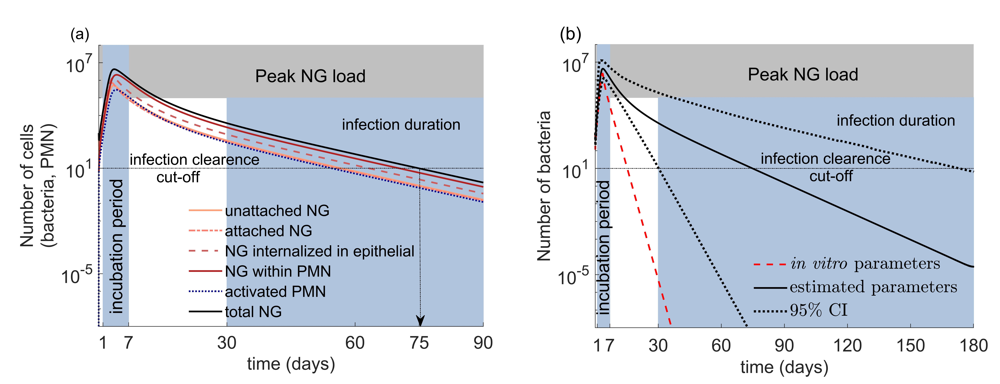

# Within_host_NG
## Modelling the in-host dynamics of Neisseria gonorrhoeae infection

This repository includes the reproducible source code for the article Jayasundara, et al. (2019) titled 'Modelling the in-host dynamics of Neisseria gonorrhoeae infection' developed to capture the time course of urethral NG infection in men
## Directory Structure
```
|-Comparison_Craig_Model - Comparison of the simulated NG load with the study by Craig, et al. (2015)
|-LHS_intracellular_percentage - Percentage of extra and intracellular NG load simulated using LHS samples as parameter values
|-Mouse_Fitting - Fitting to mouse model data for validating model structure
|-Parameter_Estimation_In_Vitro - Parameter estimation by fitting sub-models to in vitro data
|-PMN_Delay_Model - Changing model structure to include a 3 days delay in PMN recruitment
|-Point_Estimate_Intracellular_Percentage - Percentage of extra and intracellular NG load simulated using point estimates
|-Point_Estimate_Model - Natural infection time-course model using point estimates
|-sensitivity analysis - Multivariate sensitivity analysis of the full human model 
|-Supplementary_In_Vitro_Parameter_Analysis - Expanded sensitivity analysis around in vitro estimates on epithelial internalisation 
|-Total_NG_Time_Course - Time course of total NG load
```

## Model Structure

This is a compartmental mathematical model with five compartments. Four of the compartments describe interactions between NG and the host: NG unattached (B) or attached (B_a) to epithelial cells, NG internalized within epithelial cells (B_i) and NG surviving within PMN (B_s). The fifth compartment represents the activated PMN cells (N). 
Transitions between the five compartments are illustrated schematically in the below figure.


## Execution instructions
The natual infection model using point estimates as parameter values can be executed by running the script ```point_estimate_model.m```. To capture uncertainty around model outcomes and to refine plausible ranges for model parameters a multivariate sensitivity analysis was conducted. The software package SaSAT was used to generate the Latin Hypercube Sampling (LHS) samples and carry out the multivariate sensitivity analysis (Hoare, et al. 2008). From these LHS samples retaining only the parameter values that meet the qualitative features of the time course of infection is carried out by running the script ```sensitivity_full_model.m```
## Overall Analysis

Below are the generated time course of infection results using the point estimates as parameter values. 



